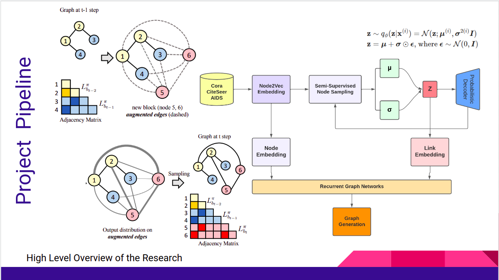
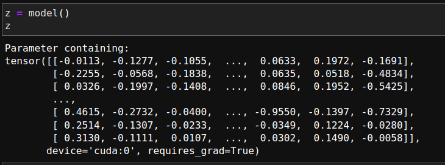
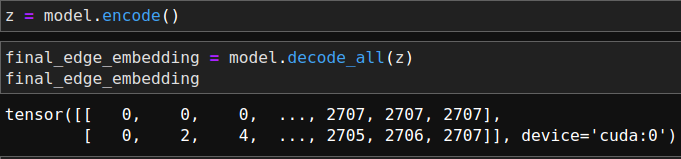
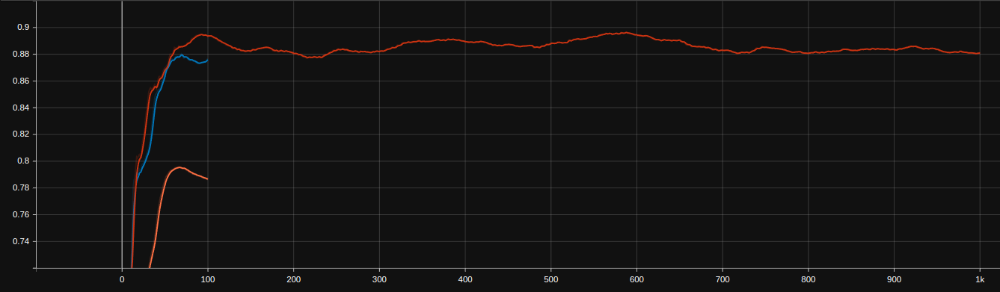
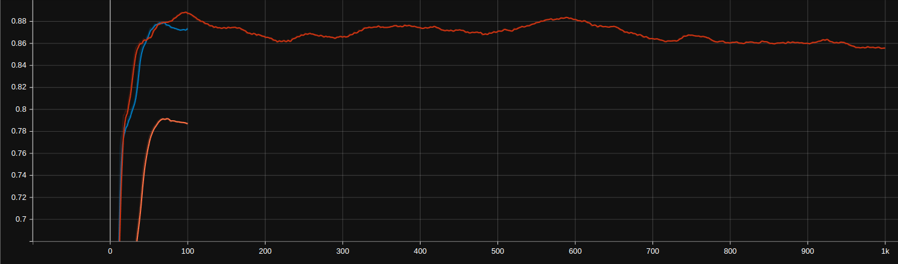
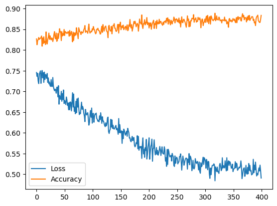
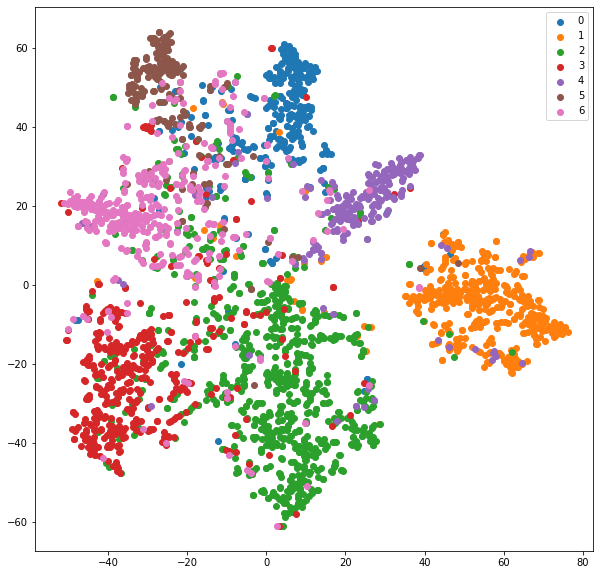

# Understanding Evolution Through Spatio-Temporal Graph Generation

> Unsupervised Graph Generation
>
> This work is part of my undergraduate minor project thesis

Presentation Slides Available at : [Project Slides](https://docs.google.com/presentation/d/1zIdqB4HHu4SscOXbCGONXDa6K6M50NRCj3653mB6IN4/edit?usp=sharing)

## Experimentation Results

| Figure                                                       | Description                                               |
| ------------------------------------------------------------ | --------------------------------------------------------- |
|  | Node2Vec Embeddings                                       |
|  | Edge-Link Prediction using Graph Variational AutoEncoders |
|  | Average Precision                                         |
|  | Area under Precision Recall                               |
|  | Node Embedding Accuracy                                   |
|  | TSNE Projection of Node Embeddings                        |

